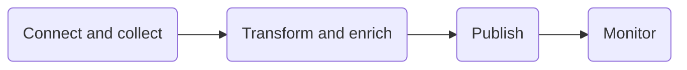

# Components summary

## Azure Data Factory
>
> - Azure Data Factory is the cloud-based ETL and data integration service that allows you to create data-driven workflows for orchestrating data movement and transforming data at scale
>
> - To create data factories you need the following permission depending on the resource you want to create
>
> | Data Factory Instances | Data Factory Objects |
> | :-- | :-- |
> |Contributor   Owner   Administrator| Data Factory Contributor (Azure Portal)   Contributor (Powershell or SDK)|
>
> - To create Data Factory **instances**, the user account that you use to sign in to Azure must be a member of the **contributor** or **owner role**, or an **administrator** of the Azure subscription.
>
> - 
>

>
> - Azure Data Factory is composed of four core components
> 
> - Linked Services enables you to define data sources, or compute resource that is required to ingest and prepare data
> - Datasets represent data structures within the data store that is being referenced by the Linked Service object
> - Activities typically contain the transformation logic or the analysis commands of the Azure Data Factory’s work. Multiple activities can be logically grouped together with an object referred to as a **Pipeline**
> >
> > - there are three categories
> > >
> > > - Data movement activities:  simply move data from one data store to another
> > > - Data transformation activities
> > > - Control activities
> > >
> - Control flow is an orchestration of pipeline activities
> - Integration Runtime (IR) is the compute infrastructure used by Azure Data Factory. It provides the bridge between the activity and linked services.
> - An Azure integration runtime is capable of:
>>
>> - Running Data Flows in **Azure**
>> - Running Copy Activity between **cloud data stores**
>> - Dispatching the following transform activities in **public network**: MapReduce activity, HDInsight, Spark activity
> It provides several ways of moving data such as:
>
> |IR type |Public network | Private network|
>   | --- | --- | --- |
> | Azure | Data Flow Data movement  Activity dispatch||
> |Self-hosted | Data movement Activity dispatch | Data movement Activity dispatch|
> |Azure-SSIS |SSIS package execution |SSIS package execution|
>
> |Self-hosted |  | |
> | -- | -- | -- |
> |Running copy activity between a cloud data store and a data store in the private network. |  |
> | Dispatching the following transform activities against compute resources in on-premises or Azure Virtual Network:   HDInsight Hive activity (BYOC-Bring Your Own Cluster)   HDInsight Pig activity (BYOC)   HDInsight MapReduce activity (BYOC)   HDInsight Spark activity (BYOC)   HDInsight Streaming activity (BYOC)   Machine Learning Batch Execution activity   Machine Learning Update Resource activities   Stored Procedure activity   Data Lake Analytics U-SQL activity   Custom activity (runs on Azure Batch)   Lookup activity   Get Metadata activity. | |
>
> - To ingest data with Data Factory use:
>
> | Copy Activity | Compute Resources | SSIS Packages |
> | --- |       --- |           --- |
> | code-free data ingestion   no transformation needed during extraction    |call on compute resources to process data by a data platform service that may be better suited to the job such as   Azure Machine Learning   Azure Data Lake Analytics   Azure SQL, Azure SQL Data Warehouse, SQL Server   Azure Databricks   Azure Function   |           Lift and shift existing SSIS workload by creating Azure-SSIS Integration Runtime    |
