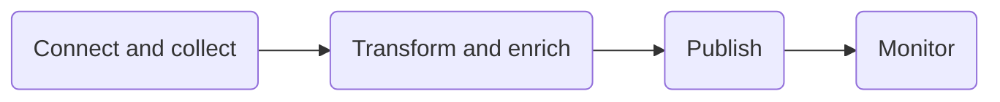

# Components summary

## Azure Data Factory
>
> - Azure Data Factory is the cloud-based ETL and data integration service that allows you to create data-driven workflows for orchestrating data movement and transforming data at scale
>
> - To create data factories you need the following permission depending on the resource you want to create
>
> | Data Factory Instances | Data Factory Objects |
> | :-- | :-- |
> |Contributor   Owner   Administrator| Data Factory Contributor (Azure Portal)   Contributor (Powershell or SDK)|
>
> - To create Data Factory **instances**, the user account that you use to sign in to Azure must be a member of the **contributor** or **owner role**, or an **administrator** of the Azure subscription.
>
> - 
>

>
> - Azure Data Factory is composed of four core components
> 
> - Linked Services enables you to define data sources, or compute resource that is required to ingest and prepare data
> - Datasets represent data structures within the data store that is being referenced by the Linked Service object
> - Activities typically contain the transformation logic or the analysis commands of the Azure Data Factory’s work. Multiple activities can be logically grouped together with an object referred to as a **Pipeline**
> >
> > - there are three categories
> > >
> > > - Data movement activities:  simply move data from one data store to another
> > > - Data transformation activities
> > > - Control activities
> > >
> - Control flow is an orchestration of pipeline activities
> >
> > - **Chaining activities**: chain activities in a sequence within a pipeline. It is possible to use the dependsOn property.
> > - **Branching activities**: evaluates a set of activities and execute them when the condition is true. Else an alternate set of activities is executed
>> - **Parameters**: You can define parameters at the pipeline level and pass arguments while you're invoking the pipeline on-demand or from a trigger. Activities then consume the arguments held in a parameter as they are passed to the pipeline.
>>>
>>> - A use-case for this scenario is connecting to several different databases that are on the same SQL server, in which you might think about parameterizing the database name in the linked service definition. The benefit of doing this is that you don't have to create a single linked service for each database that is on the same SQL Server.
>>> - Setting **global parameters** in an Azure Data Factory pipeline allows you to use these constants for consumption in pipeline expressions. A use-case for setting global parameters is when you have multiple pipelines where the parameters names and values are identical.
>>>
>> - **Custom state passing**: is an activity that created output or the state of the activity that needs to be consumed by a subsequent activity in the pipeline. An example is that in a JSON definition of an activity, you can access the output of the previous activity. Using custom state passing enables you to build workflows where values are passing through activities.
>> - **Looping containers**: defines repetition in a pipeline. It enables you to iterate over a collection and runs specified activities in the defined loop.(i.e. Until activity, for each activity)
> > >
> > > - If a For Each loop is used as a control flow activity, Azure Data Factory can start multiple activities in parallel.
> > >
>> - **Trigger-based flows**: Pipelines can be triggered by on-demand (event-based, for example, blob post) or wall-clock time.
>> - **Invoke a pipeline from another pipeline**: The Execute Pipeline activity with Azure Data Factory allows a Data Factory pipeline to invoke another pipeline.
>> - **Delta flows**: Use-cases related to using delta flows are delta loads. Delta loads in ETL patterns will only load data that has changed since a previous iteration of a pipeline. Capabilities such as lookup activity, and flexible scheduling helps handling delta load jobs. In the case of using a Lookup activity, it will read or look up a record or table name value from any external source. This output can further be referenced by succeeding activities.
>> - **Web activity**:  can call a custom RESTendpoint from a Data Factory pipeline. Datasets and linked services can be passed in order to get consumed by the activity.
>> - **Get metadata activity**: The Get metadata activity retrieves the metadata of any data in Azure Data Factory.
>>
> - Integration Runtime (IR) is the compute infrastructure used by Azure Data Factory. It provides the bridge between the activity and linked services.
> - An Azure integration runtime is capable of:
>>
>> - Running Data Flows in **Azure**
>> - Running Copy Activity between **cloud data stores**
>> - Dispatching the following transform activities in **public network**: MapReduce activity, HDInsight, Spark activity
> It provides several ways of moving data such as:
>
> |IR type |Public network | Private network|
>   | --- | --- | --- |
> | Azure | Data Flow Data movement  Activity dispatch||
> |Self-hosted | Data movement Activity dispatch | Data movement Activity dispatch|
> |Azure-SSIS |SSIS package execution |SSIS package execution|
>
> |Self-hosted |  | |
> | -- | -- | -- |
> |Running copy activity between a cloud data store and a data store in the private network. |  |
> | Dispatching the following transform activities against compute resources in on-premises or Azure Virtual Network:   HDInsight Hive activity (BYOC-Bring Your Own Cluster)   HDInsight Pig activity (BYOC)   HDInsight MapReduce activity (BYOC)   HDInsight Spark activity (BYOC)   HDInsight Streaming activity (BYOC)   Machine Learning Batch Execution activity   Machine Learning Update Resource activities   Stored Procedure activity   Data Lake Analytics U-SQL activity   Custom activity (runs on Azure Batch)   Lookup activity   Get Metadata activity. | |
>
> ### To ingest data with Data Factory use
>
> | Copy Activity | Compute Resources | SSIS Packages |
> | --- |       --- |           --- |
> | code-free data ingestion   no transformation needed during extraction    |call on compute resources to process data by a data platform service that may be better suited to the job such as   Azure Machine Learning   Azure Data Lake Analytics   Azure SQL, Azure SQL Data Warehouse, SQL Server   Azure Databricks   Azure Function   |           Lift and shift existing SSIS workload by creating Azure-SSIS Integration Runtime    |
>
> ### To transform data with Data Factory use
> >
> |Mapping Data Flow | Compute Resources | SSIS Packages |
> | ---| ---| --- |
> | code free data transformation    executed on scaled-out Apache Spark clusters that are automatically provisioned   enable debug mode, to turns on a small interactive Spark cluster| call on compute resources to process data by a data platform service that may be better suited to the job such as   Azure Machine Learning   Azure Data Lake Analytics   Azure SQL, Azure SQL Data Warehouse, SQL Server   Azure Databricks   Azure Function   |           Lift and shift existing SSIS workload by creating Azure-SSIS Integration Runtime    |
>
> Mapping Data Flows provides a number of different [transformations](https://docs.microsoft.com/en-us/azure/data-factory/data-flow-transformation-overview) types that enable you to modify data. They are broken down into the following categories:
>
>|Category Name | Description |
>| --- | --- |
>|Schema modifier transformations |Modifies a sink destination by creating new columns based on the action of the transformation (i.e. Derived Column transformation) |
>|Row modifier transformations | Impact how the rows are presented in the destination. (i.e. Sort) |
>|Multiple inputs/outputs transformations | Generate new data pipelines or merge pipelines into one. (i.e. Union transformation that combines multiple data streams) |
